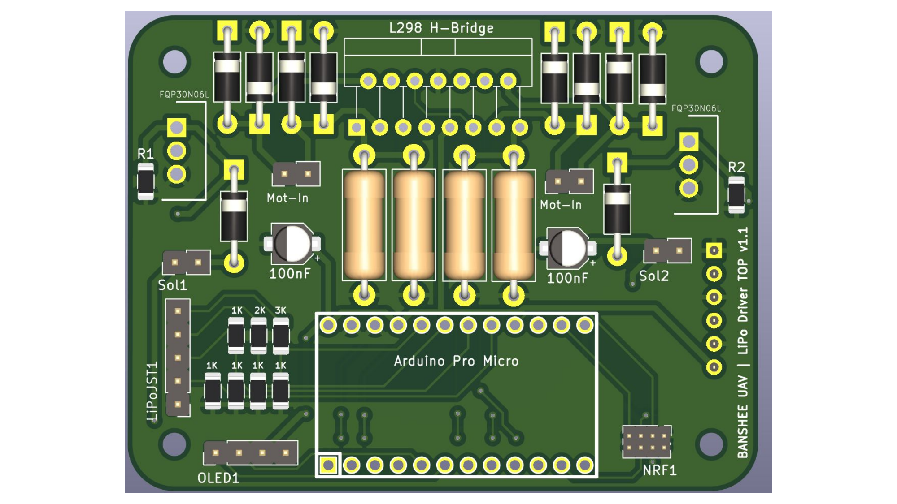
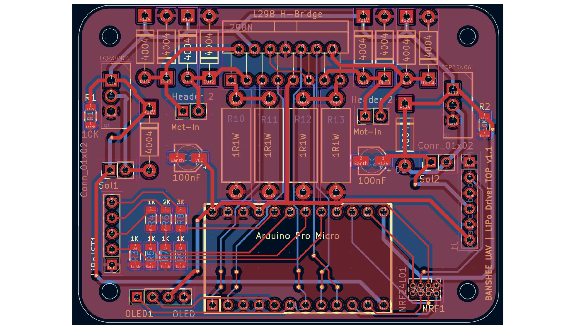
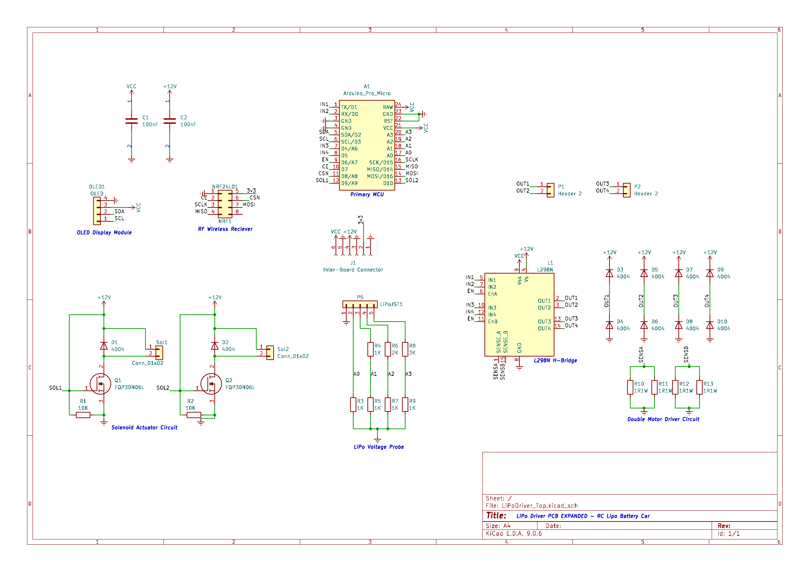
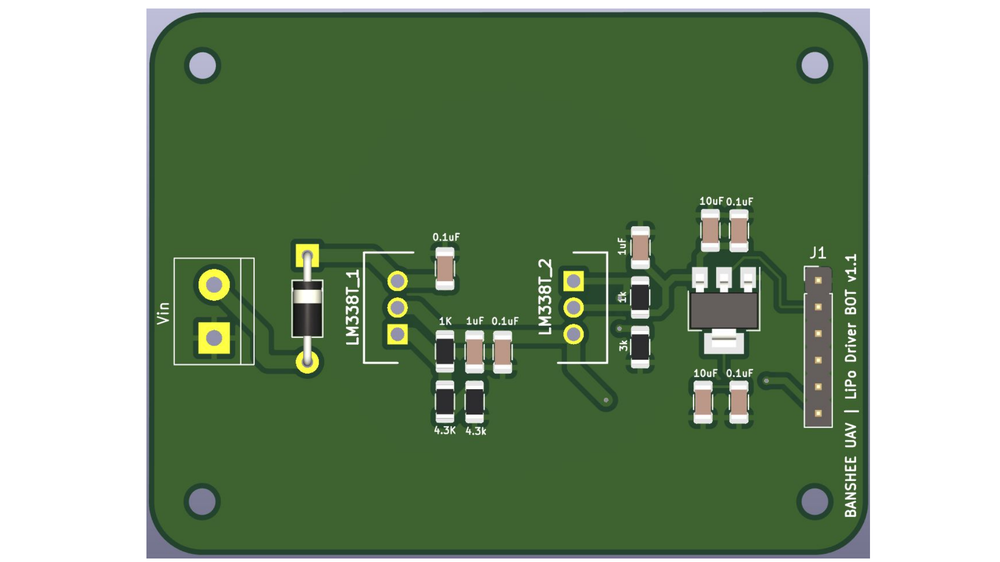
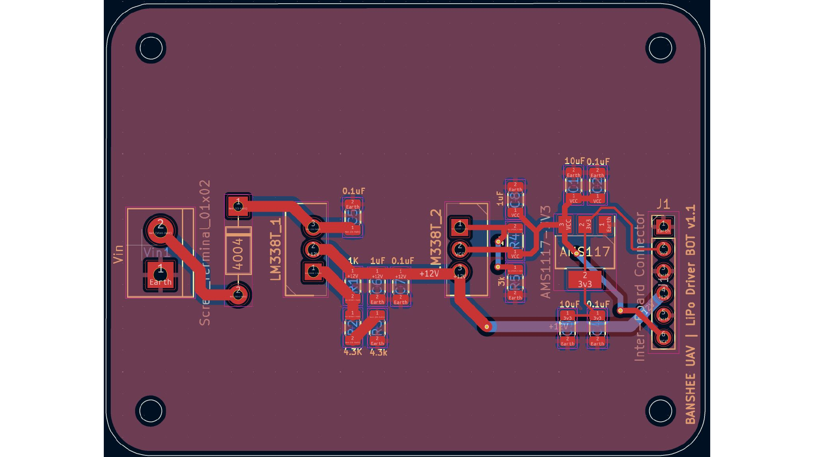
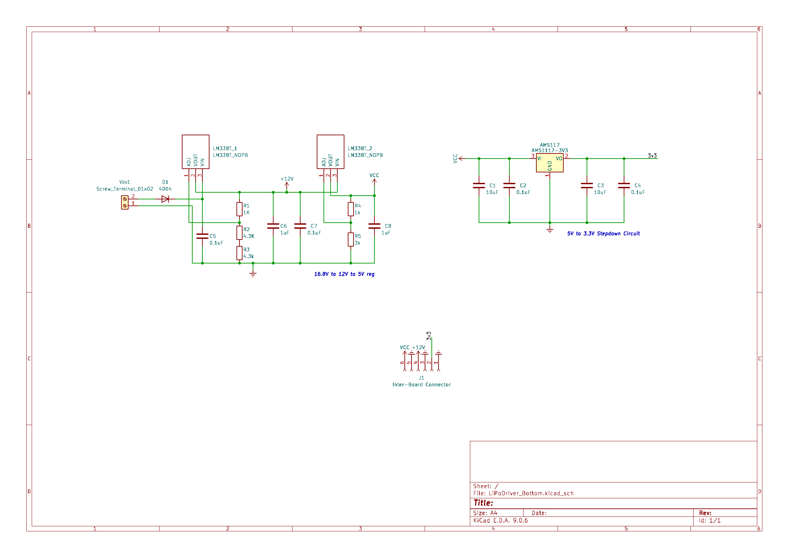
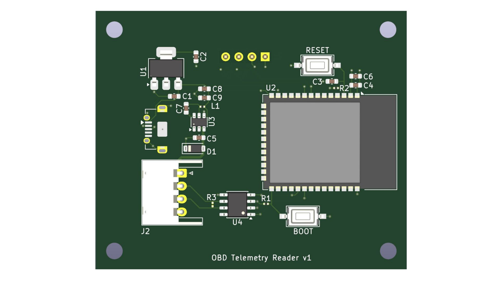
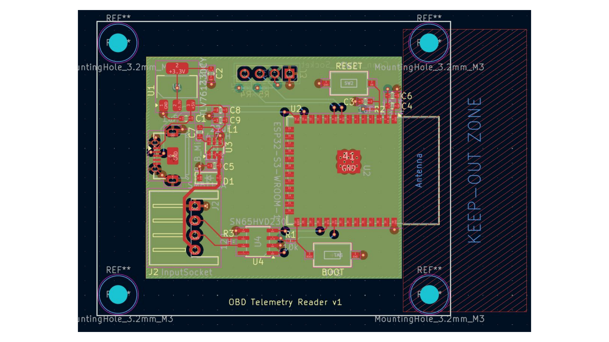
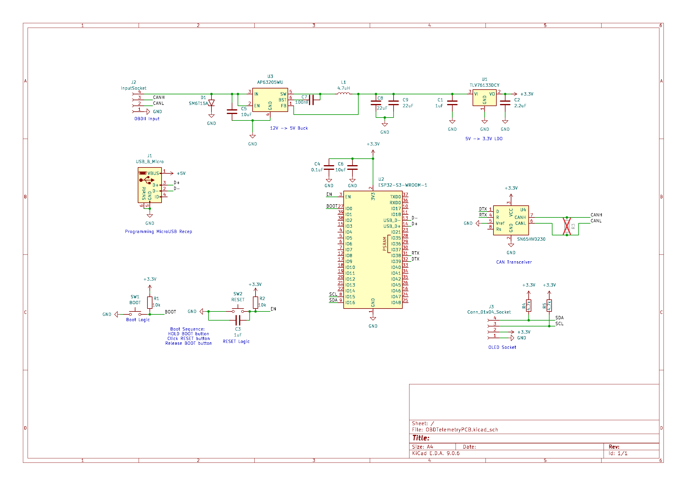

# Hardware Design Portfolio — Mohamed Hamida

A collection of PCB designs spanning power electronics, embedded systems, motor control, and automotive telemetry. Personal projects are designed in **KiCad 9**, alongside a production evaluation module designed in **Altium** during my time at **Texas Instruments**.

---

## Projects

### 1. Banshee UAV — LiPo Driver Board (Top)

A self-contained controller board for an RC LiPo-powered platform, combining motor drive, wireless control, status display, and battery monitoring on a single Arduino-based stack.

**Highlights**
- **MCU:** Arduino Pro Micro (ATmega32U4)
- **Motor drive:** L298N dual H-Bridge with 1Ω current-sense resistors and 1N4004 flyback diode arrays
- **Solenoid drivers:** 2× FQP30N06L N-channel MOSFETs with 10kΩ pull-downs, gate-driven directly from MCU
- **Wireless:** NRF24L01 2.4 GHz transceiver
- **Display:** I²C OLED module
- **Telemetry:** LiPo voltage divider network (1k/2k/3k + 1k/1k/1k/1k taps) feeding A0–A3
- **Inter-board link:** 6-pin header passing VCC / +12V / GND to the bottom power board

| 3D Render | Layout | Schematic |
|---|---|---|
|  |  |  |

---

### 2. Banshee UAV — LiPo Driver Board (Bottom / Power Stage)

The companion power-conditioning board that sits beneath the controller. Takes raw 4S LiPo input and produces all rails consumed by the top board.

**Highlights**
- **Input:** 16.8 V nominal (4S LiPo) via screw terminal, with 1N4004 reverse-polarity protection
- **12 V rail:** LM338T adjustable linear regulator (5 A capable) with 1k / 4.3k / 4.3k feedback divider
- **5 V rail:** Second LM338T staged off the 12 V rail, with 1k / 3k feedback divider
- **3.3 V rail:** AMS1117-3V3 LDO from the 5 V rail
- **Output:** 6-pin inter-board connector mating to the controller board

| 3D Render | Layout | Schematic |
|---|---|---|
|  |  |  |

---

### 3. OBD-II Telemetry Reader v1

A compact ESP32-based dongle that plugs into a vehicle's OBD-II port, decodes CAN bus traffic, and exposes telemetry over Wi-Fi/Bluetooth for logging or live dashboards.

**Highlights**
- **MCU:** ESP32-S3-WROOM-1 (Wi-Fi + BLE, with PCB antenna keep-out zone respected)
- **CAN interface:** TI SN65HVD230 transceiver wired to CANH / CANL on the OBD-II socket
- **Input protection:** SMBT15A TVS diode on the OBD-II line (load-dump / transient rejection)
- **Power tree:** 12 V → 5 V via AP63205WU synchronous buck (4.7 µH inductor, 22 µF output caps), 5 V → 3.3 V via TLV76133DCY LDO
- **Programming:** USB-B Micro receptacle, with auto-boot circuit (BOOT + RESET tactile switches)
- **Expansion:** I²C OLED header for on-device status readout

| 3D Render | Layout | Schematic |
|---|---|---|
|  |  |  |

---

### 4. INA423xEVM — Texas Instruments

Production evaluation module designed during my time at **Texas Instruments** for the INA423x family of current-sense amplifiers. Released as an official TI EVM and is sold through TI's catalog.

🔗 **[INA423XEVM on ti.com](https://www.ti.com/tool/INA423XEVM)**

---

## Tools & Workflow

| Area | Tool |
|---|---|
| Schematic capture & PCB layout | KiCad 9 (personal projects), Altium Designer (TI work) |
| 3D / mechanical | KiCad 3D viewer, STEP export |
| Simulation | LTspice, KiCad/ngspice |
| Firmware | Arduino, ESP-IDF, C/C++ |

---

## Contact

- **Email:** momaj901@gmail.com
